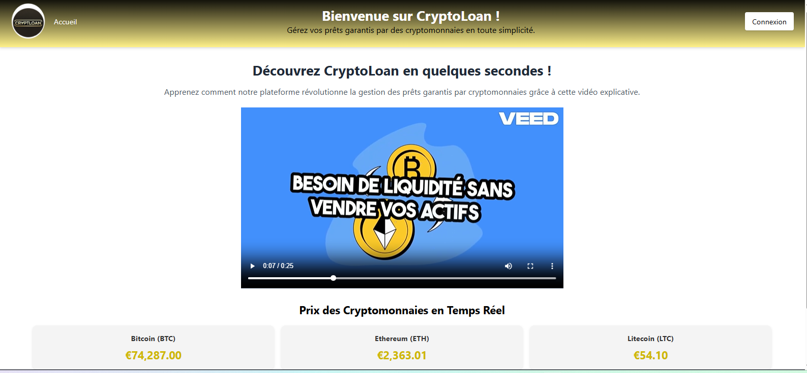
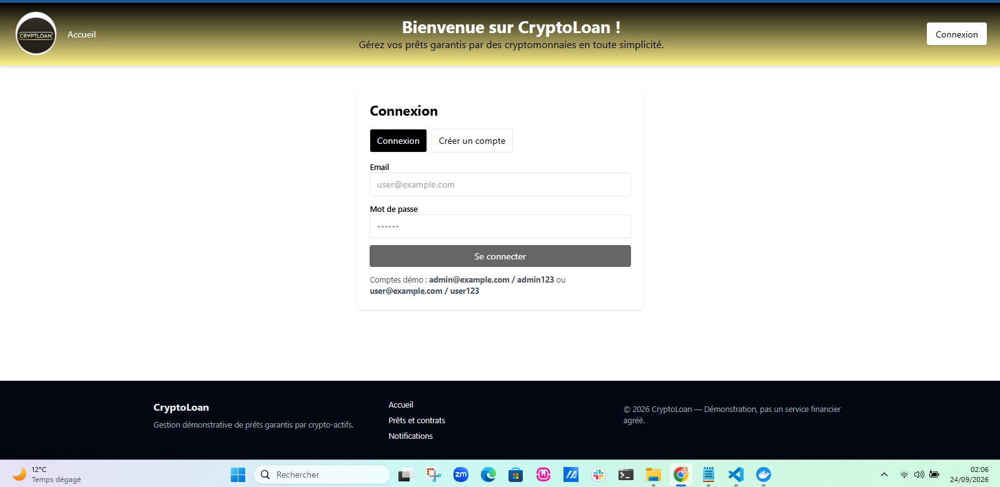
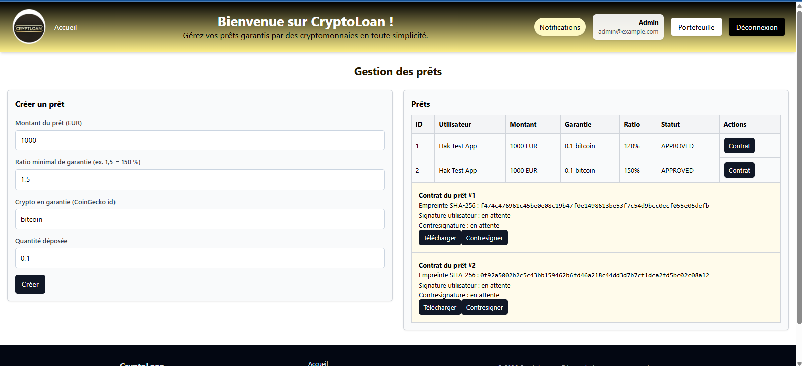
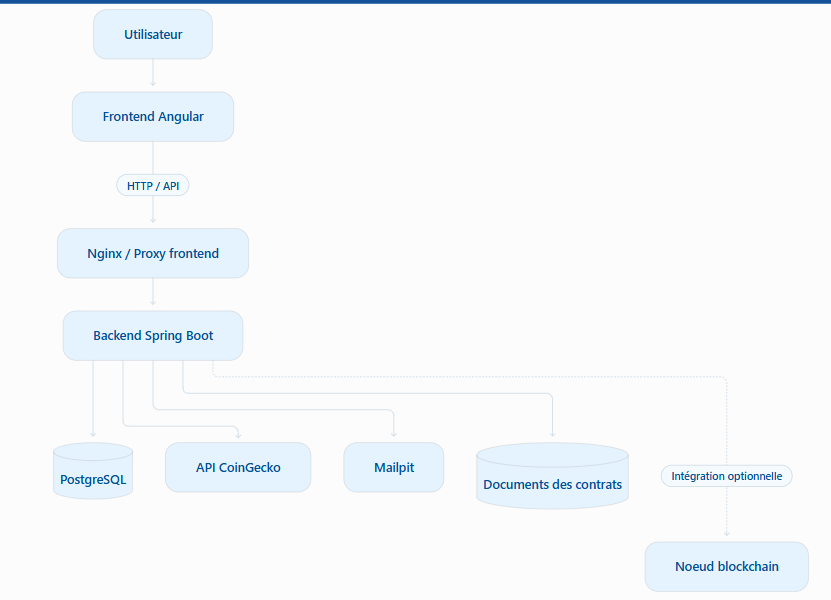
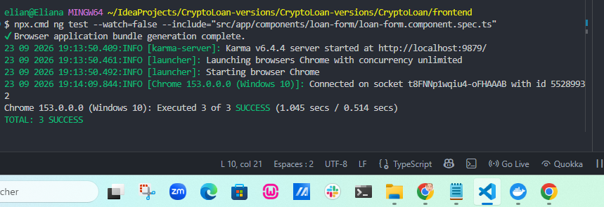
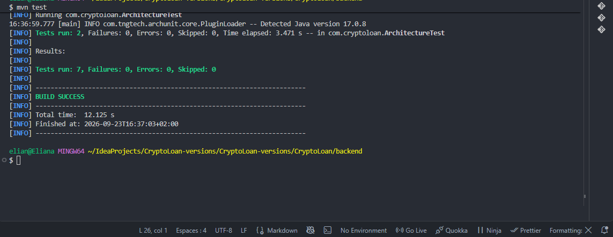
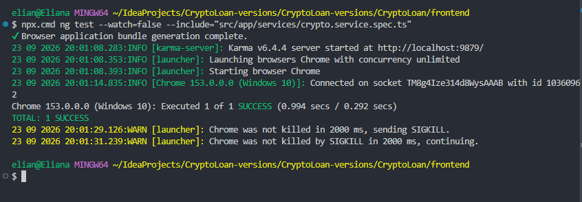
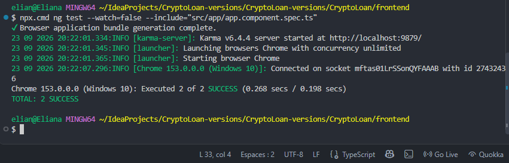

# CryptoLoan

CryptoLoan est une application de démonstration consacrée aux prêts garantis par des crypto-actifs. Elle permet d'explorer le cycle de vie d'un prêt, de la saisie d'une demande au suivi de sa garantie et de son contrat. Le projet associe une interface Angular, une API Spring Boot et une base PostgreSQL. Il s'exécute localement avec Docker Compose.


## Fonctionnement

L'utilisateur renseigne le montant demandé, le crypto-actif déposé, la quantité et le ratio de garantie. L'application communique avec le backend pour enregistrer et consulter les prêts. Elle comprend également des fonctions de gestion des garanties, de contrats et d'authentification par JWT. Le backend peut interroger CoinGecko pour obtenir des prix de crypto-actifs ; les emails de démonstration sont capturés par Mailpit.

## Aperçu de l'application




## Architecture



Le frontend est servi par Nginx dans son conteneur. Le backend porte les règles métier et expose les endpoints de l'API. PostgreSQL conserve les données applicatives. Docker Compose relie les services et attend que les dépendances déclarées soient prêtes avant de démarrer les services concernés. Le nœud blockchain dispose d'un profil Docker optionnel ; son activation et ses usages exacts sont décrits séparément.

Les choix d'architecture et les interfaces sont détaillés dans [Architecture](docs/ARCHITECTURE.md) et [API](docs/API.md).

## Démarrage local

**Prérequis :** Docker avec Docker Compose.

Depuis la racine du projet :

```bash
cp .env.example .env
```

Ouvrir `.env` et adapter au minimum `POSTGRES_PASSWORD` et `JWT_SECRET` avant toute exposition du service. Ne jamais committer ce fichier. Les valeurs d'exemple ne sont pas des secrets utilisables en production.

```bash
docker compose up --build -d
docker compose ps
```

Une fois les services démarrés :

- Application :  http://localhost:8080 |
- Mailpit :  http://localhost:8025 |
Swagger UI  À vérifier selon la configuration du proxy et du backend ; voir [API](docs/API.md) |

La disponibilité des conteneurs se vérifie avec `docker compose ps`. Un état `healthy` indique que la sonde configurée répond, pas que tous les parcours fonctionnels ont été testés.

Pour consulter les journaux :

```bash
docker compose logs backend --tail=100
docker compose logs frontend --tail=100
```

Pour arrêter l'environnement sans supprimer les volumes :

```bash
docker compose down
```

## Tests

Les tests unitaires sont lancés indépendamment de Docker, sauf lorsqu'un test exige explicitement un service externe.

**Backend — Maven**

```bash
cd backend
mvn test
```

**Frontend — Angular, Karma et Jasmine**

Dans un autre terminal, depuis la racine :

```bash
cd frontend
npm test -- --watch=false
```

Sous Git Bash sur Windows, utiliser npm.cmd si PowerShell bloque les scripts npm. Les tests frontend utilisent des dépendances simulées lorsque c'est nécessaire ; leur réussite ne remplace pas un test d'intégration de bout en bout.

Au dernier contrôle documenté, 7 tests backend et 10 tests frontend ont réussi. Ces chiffres décrivent cette exécution et devront être actualisés lorsque la suite évoluera.

### Captures des vérifications











## Organisation du dépôt

```text
CryptoLoan/
- backend/             API Spring Boot et tests Maven
- frontend/            Application Angular et tests Jasmine/Karma
-  blockchain/          Composants blockchain optionnels
- docs/                Documentation technique
   -- images/          Captures utilisées dans ce README
- docker-compose.yml   Services de l'environnement local
-  .env.example         Modèle de configuration
- README.md
```

## Documentation technique

- [Architecture](docs/ARCHITECTURE.md) : organisation des composants et échanges.
- [API](docs/API.md) : endpoints et utilisation de l'API.
- [Déploiement](docs/DEPLOYMENT.md) : démarrage et configuration de l'environnement.
- [Tests](docs/TESTING.md) : stratégie de vérification et commandes.
- [Sécurité](docs/SECURITY.md) : configuration et précautions de sécurité.
- [Email](docs/EMAIL.md) : configuration et tests des notifications.
- 

## Limites de la démonstration

Les comptes de démonstration et Mailpit sont prévus pour un usage local. Avant un déploiement accessible à des tiers, il faut revoir les secrets, les comptes de d, l'exposition réseau, la gestion des data et la couverture des tests. La présence d'une sonde de santé et de tests unitaires ne suffit pas pour la prod
